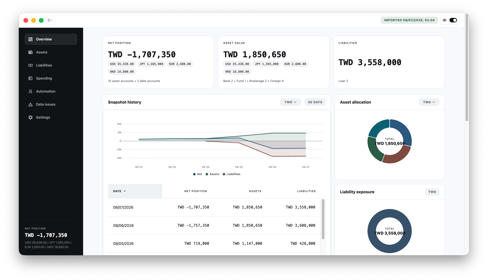
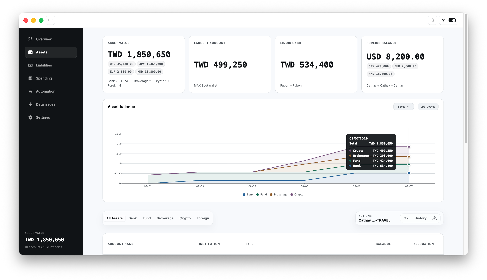
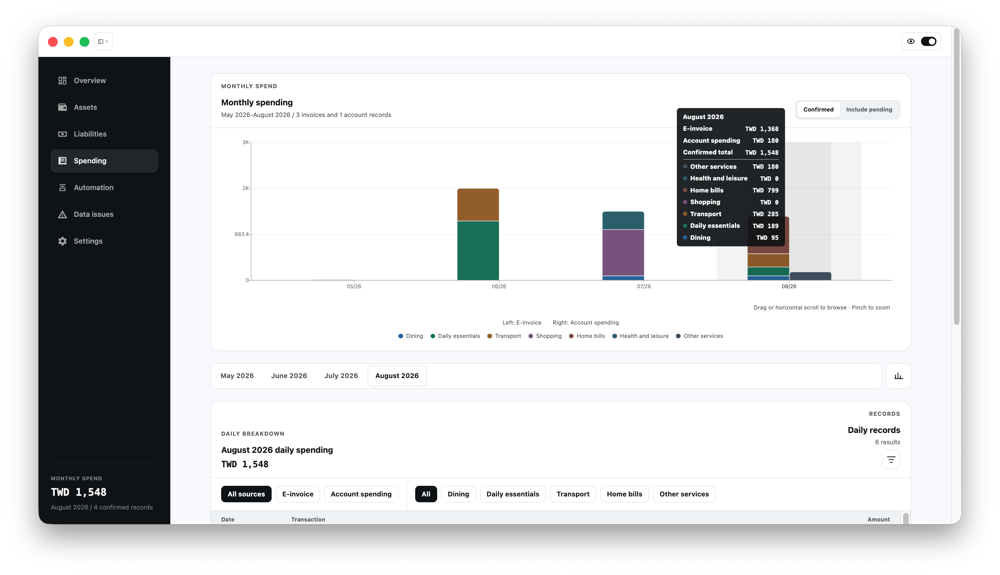
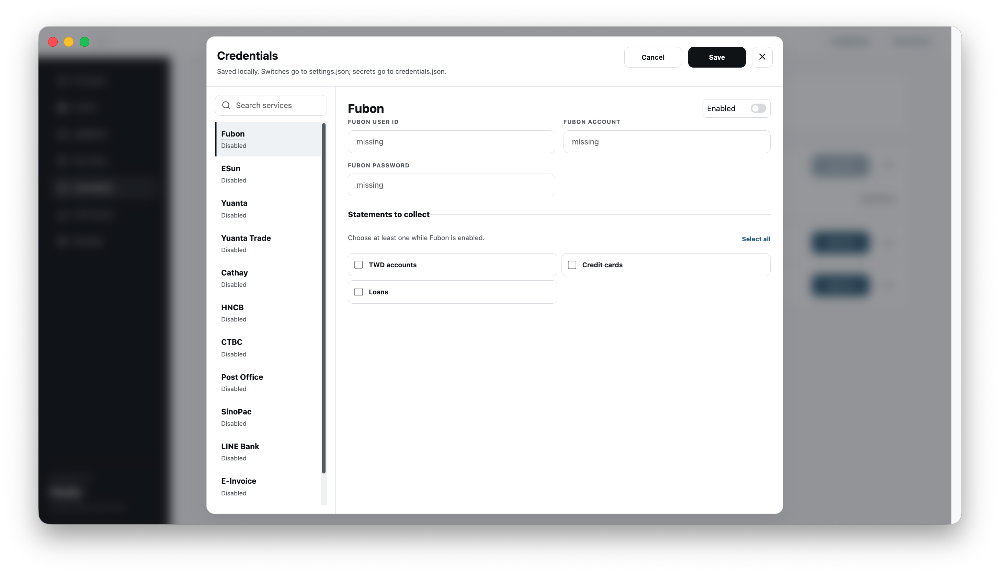

# OctopusBeak

[繁體中文](README.md)

Bring data scattered across bank accounts, brokerage accounts, and E-Invoices back to your Mac. OctopusBeak opens provider sites, downloads statements, organizes them in a local ledger, and gives you one place to review assets, liabilities, and spending.

## Download and install

OctopusBeak currently supports **macOS on Apple Silicon (arm64)**. Windows, Linux, and Intel Macs are not supported yet.

[Download the latest OctopusBeak release](https://github.com/WangWilly/OctopusBeak/releases/latest)

1. Download the DMG from the latest release.
2. Open it and drag OctopusBeak into Applications.
3. Launch OctopusBeak from Applications.

The DMG is the recommended installer. A ZIP and `SHA256SUMS.txt` are also available on the release page.

## What you can do

### Review assets and liabilities together

The overview combines imported bank deposits, foreign currency, funds, brokerage accounts, crypto assets, and loans. Daily snapshots show changes over time, allocation, and liability exposure.



### Inspect asset changes and account details

The Assets page groups bank, fund, brokerage, crypto, and foreign-currency accounts. Review balance trends, then open an account to inspect trades or positions.



### Organize E-Invoices and account spending

The Spending page combines E-Invoices and account expenses, grouped by month and category. You can inspect invoice items and correct their categories.



### Collect data from the desktop app

The Automation page keeps sources, sign-in details, run history, and human assistance in one place. Enable each source separately and choose which statement types to collect.



## First run

1. Open OctopusBeak and use Welcome to choose a language and whether to start setup.
2. Choose one source, enter its sign-in details, and select statement types.
3. Start collection. Complete any CAPTCHA or OTP requested by the provider.
4. Run Import after collection finishes.
5. Return to Overview to review the result.

The app remembers onboarding progress, so you can quit and continue later. You can also restart onboarding from Settings.

## Supported sources

| Source | Available data |
| --- | --- |
| Fubon | TWD deposits, credit cards, loans |
| ESun | Credit cards |
| Yuanta | TWD deposits, foreign currency, loans, credit cards, funds |
| Yuanta Trade | Positions and trades |
| Cathay | TWD deposits and foreign currency |
| HNCB | TWD deposits |
| CTBC | TWD deposits |
| Post Office | TWD deposits |
| SinoPac | TWD deposits; foreign-currency canonical transactions (human-attested identity contract) |
| LINE Bank | TWD deposits and foreign currency |
| E-Invoice | Personal invoices and purchased items |
| MAX / MaiCoin | Crypto balances and statement rows |

SinoPac foreign-currency statements are collected and retained as traceable source evidence, and their rows are promoted to canonical Financial Transactions under a human-attested identity contract. Advertised canonical foreign-currency support currently includes SinoPac, Yuanta, Cathay, and LINE Bank.

## Your data stays on your device

Downloaded statements, the ledger, automation settings, and run history are stored locally. Sign-in details also stay on your Mac and are encrypted with Electron `safeStorage`. If secure encryption is unavailable, OctopusBeak stops at startup instead of writing plaintext passwords.

CAPTCHAs, OTPs, session cookies, and other authentication material are not sent to a model. When a provider asks for manual verification, you complete it in the window.

## Developer information

<details>
<summary>Run from source</summary>

```bash
npm install
npm run libretto:setup
npm run typecheck
npm run desktop:dev
```

The UI is Electron-only and loads the static renderer at `#/overview`.

Build an unsigned local app:

```bash
npm run desktop:package
open out/OctopusBeak-darwin-arm64/OctopusBeak.app
```

See [Desktop release](docs/desktop-release.md) for signing and notarization.

</details>

<details>
<summary>CLI and local ledger</summary>

The packaged desktop app includes Libretto, so regular users do not need to install the CLI. For workflow development, run the npm scripts directly:

```bash
npm run run:fubon-all-statements
npx libretto resume --session <session-name>
npm run run:import-downloads-csv
npm run libretto:close-all
```

Workflows write files under `downloads/<workflow-name>/`. The preferred shape is one CSV per dataset with matching JSON metadata. The importer writes records to `data/ledger/ledger.sqlite`.

Create a mock ledger:

```bash
npm run run:seed-mock-ledger-db
npm run desktop:dev:mock
```

For direct MAX / MaiCoin sync, set `MAX_ACCESS_KEY`, `MAX_SECRET_KEY`, and `MAX_SUB_ACCOUNT`, then run:

```bash
npm run run:sync-maicoin
```

</details>

<details>
<summary>Project paths and checks</summary>

| Path | Purpose |
| --- | --- |
| `src/workflows/` | Libretto browser workflows |
| `src/ledger/` | Importers, parsers, migrations, and overview data models |
| `src/lib/overview/`, `src/lib/assets/`, `src/lib/liabilities/` | Financial overview UI |
| `src/lib/spending/` | E-Invoice and spending UI |
| `src/lib/automation/` | Automation UI and server helpers |
| `electron/` | Electron main process and runtime helpers |
| `downloads/` | Local statement exports |
| `data/ledger/` | Local SQLite ledger |
| `~/Library/Application Support/OctopusBeak/` | Packaged app runtime data |

Before committing changes, run:

```bash
npm run typecheck
npm run build
npm run check:libretto-patch
npm run privacy-check
npm run secrets-check
```

</details>
