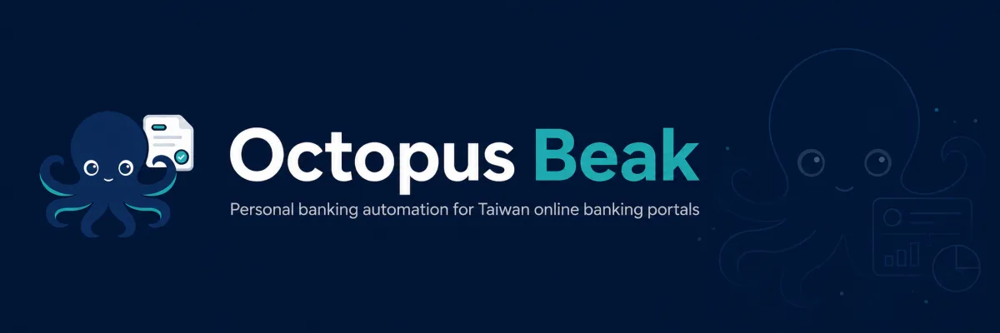

# OctopusBeak

Personal banking automation for Taiwan online banking portals.

OctopusBeak uses Libretto to run headed browser workflows for bank portals, download statement data, normalize files into CSV/JSON outputs, import them into a local SQLite ledger, and inspect the result in a Svelte dashboard.

All downloaded statements, browser sessions, ledger databases, and credentials are sensitive local data. Keep `downloads/`, `data/`, `.libretto/`, and `.env` out of commits and shared archives.

## What It Does

- Runs guided browser automations for supported Taiwan banking portals.
- Pauses for manual steps such as CAPTCHA, OTP, email verification, or certificate selection.
- Saves clean local statement exports under `downloads/<workflow-name>/`.
- Imports downloaded CSV files into `data/ledger/ledger.sqlite`.
- Shows local portfolio views at `/overview`, `/assets`, and `/liabilities`.
- Syncs MAX/MaiCoin balances and statement rows into the same ledger.

## Quick Start

```bash
npm install
npm run libretto:setup
cp .env.example .env
npm run typecheck
```

Fill `.env` only with the credentials required by the workflow you are running.

Start the local dashboard:

```bash
npm run dev
```

Open `http://localhost:5173/overview`.

## Recommended Flow

1. Download new statements with a headed workflow.
2. Complete any manual browser checks when Libretto pauses.
3. Import downloaded CSV files into the local ledger.
4. Review the local dashboard.

```bash
npm run run:fubon-all-statements
npx libretto resume --session <session-name>
npm run run:import-downloads-csv
npm run dev
```

Clean up interrupted browser sessions:

```bash
npm run libretto:close-all
```

## Supported Workflows

| Source      | Command                                          | Output                                                    |
| ----------- | ------------------------------------------------ | --------------------------------------------------------- |
| Fubon       | `npm run run:fubon-all-statements`               | deposit, credit card, loan statements                     |
| Fubon       | `npm run run:fubon-statements`                   | deposit statements                                        |
| Fubon       | `npm run run:fubon-credit-card-statements`       | credit card statements                                    |
| Fubon       | `npm run run:fubon-loan-statements`              | loan statements                                           |
| ESun        | `npm run run:esun-credit-card-statements`        | credit card statements                                    |
| Yuanta      | `npm run run:yuanta-all-statements`              | TWD, foreign-currency, loan, credit card, fund statements |
| Yuanta      | `npm run run:yuanta-statements`                  | TWD account statements                                    |
| Yuanta      | `npm run run:yuanta-foreign-currency-statements` | foreign-currency statements                               |
| Yuanta      | `npm run run:yuanta-loan-statements`             | loan statements                                           |
| Yuanta      | `npm run run:yuanta-credit-card-statements`      | credit card statements                                    |
| Yuanta      | `npm run run:yuanta-fund-statements`             | fund holdings and transactions                            |
| Yuanta      | `npm run run:yuanta-trade-statements`            | brokerage holdings and trade records                      |
| Cathay      | `npm run run:cathay-all-statements`              | TWD and foreign-currency statements                       |
| Cathay      | `npm run run:cathay-statements`                  | TWD account statements                                    |
| Cathay      | `npm run run:cathay-foreign-statements`          | foreign-currency statements                               |
| HNCB        | `npm run run:hncb-statements`                    | TWD account statements                                    |
| MAX/MaiCoin | `npm run run:sync-maicoin`                       | crypto balances and statement rows                        |

## Output Format

Workflow outputs are written to `downloads/<workflow-name>/`.

Preferred output shape:

- one CSV table per exported dataset
- one matching JSON metadata file with the same timestamped basename
- rows sorted newest to oldest when the source includes time data
- no mixed metadata rows inside CSV tables

## Local Ledger

Import new downloads:

```bash
npm run run:import-downloads-csv
```

The importer writes to `data/ledger/ledger.sqlite`. Imported source files are tracked so the same download path is only read once. Statement rows are stored in typed tables for account transactions, credit card lines, loan transactions, fund records, brokerage records, and crypto records.

Run schema migrations directly when needed:

```bash
npm run run:migrate-ledger-db
```

## MAX/MaiCoin Sync

Add the required keys to `.env`:

```bash
MAX_ACCESS_KEY=...
MAX_SECRET_KEY=...
MAX_SUB_ACCOUNT=main
```

Then sync:

```bash
npm run run:sync-maicoin
```

This writes current balances, M-wallet debt, TWD values, and available trade/deposit/withdraw/transfer/reward/convert statement rows into the local ledger. To also export fetched statement rows as JSON:

```bash
npm run run:sync-maicoin -- --statement-json data/ledger/maicoin-statement.json
```

## Development

```bash
npm run typecheck
npm run build
npm run run:example
```

Useful project paths:

| Path                                                           | Purpose                                              |
| -------------------------------------------------------------- | ---------------------------------------------------- |
| `src/workflows/`                                               | Libretto browser workflows                           |
| `src/ledger/`                                                  | importers, parsers, migrations, dashboard model code |
| `src/lib/shared-ledger/`                                       | local ledger query and account summary helpers       |
| `src/lib/assets/`, `src/lib/overview/`, `src/lib/liabilities/` | Svelte dashboard views                               |
| `downloads/`                                                   | local statement exports                              |
| `data/ledger/`                                                 | local SQLite ledger                                  |

Before sharing changes, run:

```bash
npm run privacy-check
npm run secrets-check
```
