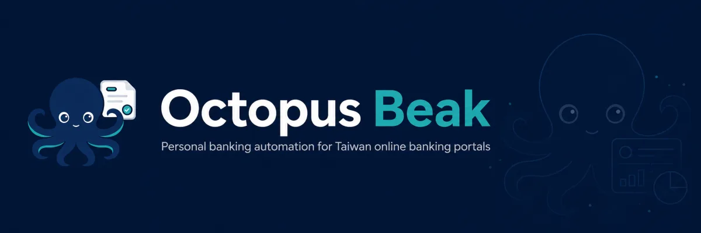
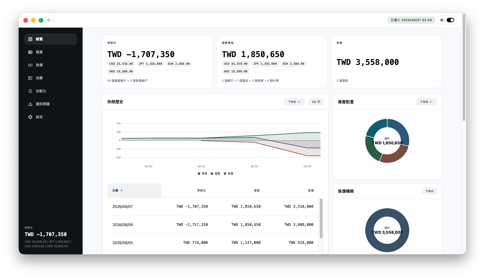
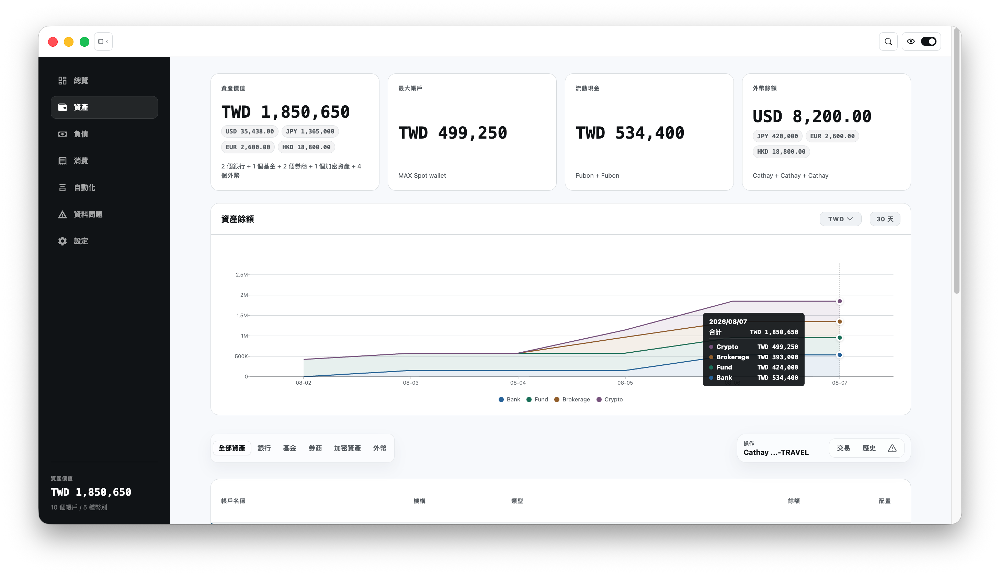
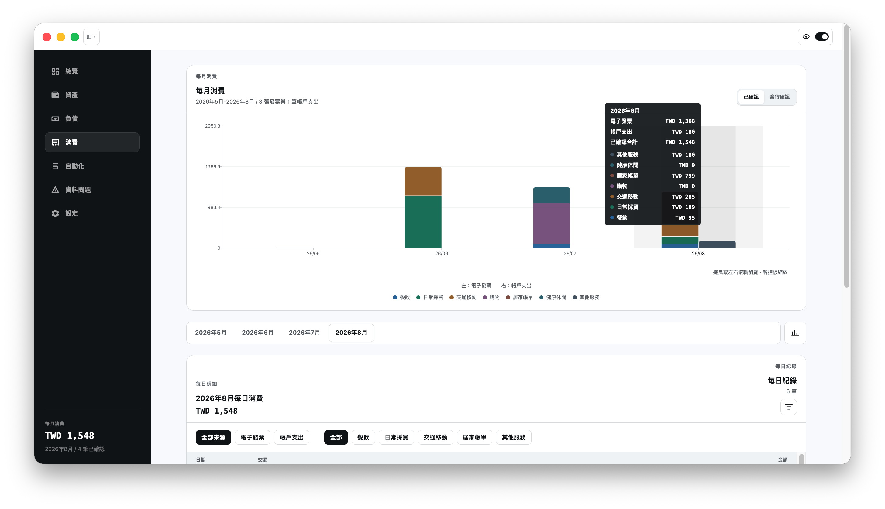
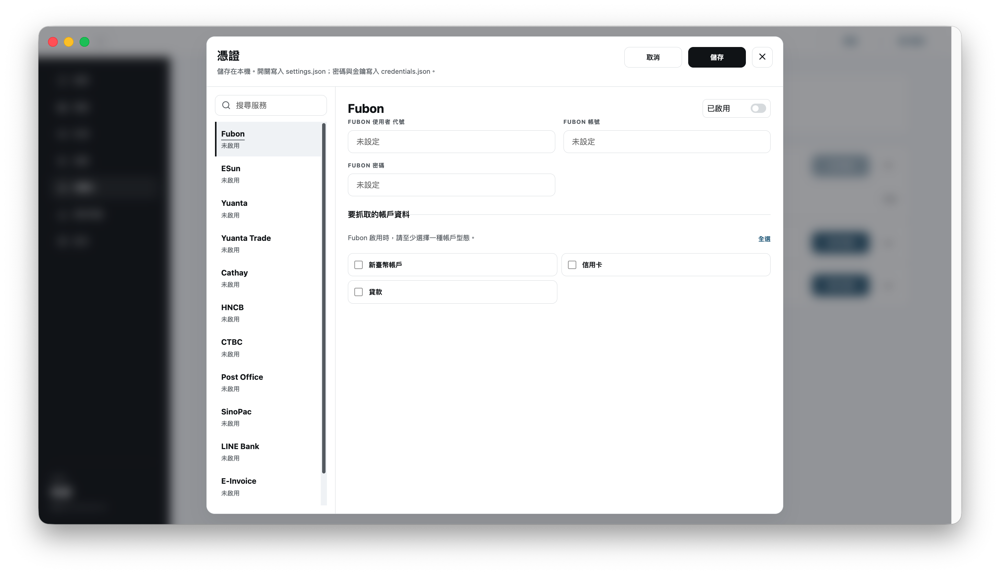

# OctopusBeak

[English](README.en.md)

把散落在銀行、證券帳戶和電子發票裡的資料收回自己的 Mac。OctopusBeak 會開啟金融服務網站、下載對帳單、整理成本機帳本，讓你在同一處查看資產、負債與支出。

## 下載與安裝

目前只提供 **macOS Apple Silicon（arm64）** 版本。Windows、Linux 與 Intel Mac 尚未支援。

[下載最新版 OctopusBeak](https://github.com/WangWilly/OctopusBeak/releases/latest)

1. 從最新版本頁面下載 DMG。
2. 開啟 DMG，將 OctopusBeak 拖進「應用程式」。
3. 從「應用程式」啟動 OctopusBeak。

建議使用 DMG 安裝。也提供 ZIP，並附上 `SHA256SUMS.txt` 供你核對檔案。

## 你可以用它做什麼

### 把資產與負債放在同一張總覽

總覽會整理匯入的銀行存款、外幣、基金、證券、加密資產與貸款。快照歷史保留每天的變化，也能看出資產配置和負債曝險。



### 查看資產變化與帳戶明細

資產頁依銀行、基金、券商、加密資產與外幣分組。你可以查看餘額趨勢，再往下查交易或持倉。



### 整理電子發票與帳戶支出

消費頁把電子發票和帳戶支出放在一起，依月份與類別統計。發票品項可以逐筆查看，也能自行修正分類。



### 從桌面程式收集資料

自動化頁面集中管理資料來源、登入資料、執行紀錄與人工協助。每個來源可以個別啟用，並選擇要收集的對帳單類型。



## 第一次使用

1. 開啟 OctopusBeak，在歡迎畫面選擇語言與是否開始設定。
2. 選擇一個資料來源，填入登入資料和要收集的對帳單類型。
3. 執行資料收集。若網站要求 CAPTCHA 或 OTP，依畫面完成驗證。
4. 收集完成後執行匯入。
5. 回到總覽查看結果。

程式會記住初始設定的進度。中途關閉也沒關係，下次開啟可以接著做；日後也能從設定重新開始。

## 支援的資料來源

| 資料來源 | 可收集資料 |
| --- | --- |
| 台北富邦銀行（Fubon） | 台幣存款、信用卡、貸款 |
| 玉山銀行（ESun） | 信用卡 |
| 元大銀行（Yuanta） | 台幣存款、外幣、貸款、信用卡、基金 |
| 元大證券（Yuanta Trade） | 持倉與交易紀錄 |
| 國泰世華銀行（Cathay） | 台幣存款、外幣 |
| 華南銀行（HNCB） | 台幣存款 |
| 中國信託銀行（CTBC） | 台幣存款 |
| 中華郵政（Post Office） | 台幣存款 |
| 永豐銀行（SinoPac） | 台幣存款、外幣 canonical 交易（human-attested identity contract） |
| LINE Bank | 台幣存款、外幣 |
| 電子發票（E-Invoice） | 發票與消費品項 |
| MAX / MaiCoin | 加密資產餘額與交易紀錄 |

SinoPac 外幣對帳單會收集並保存為可追溯的來源證據，外幣列則依 human-attested identity contract 升格為 canonical Financial Transaction。外幣 canonical 交易目前在 SinoPac、元大、國泰世華與 LINE Bank 的 advertised readiness 中提供。

## 資料留在你的裝置

下載的對帳單、帳本、自動化設定與執行紀錄都存放在本機。登入資料也只存在你的 Mac，並由 Electron `safeStorage` 加密；如果系統無法安全加密，OctopusBeak 會停止啟動，不會把密碼寫成明文。

CAPTCHA、OTP、工作階段 Cookie 與其他驗證資訊不會交給模型處理。需要人工驗證時，由你在視窗完成。

## 開發者資訊

<details>
<summary>從原始碼執行</summary>

```bash
npm install
npm run libretto:setup
npm run typecheck
npm run desktop:dev
```

桌面介面僅支援 Electron，並從 `#/overview` 載入靜態渲染器。

建立未簽署的本機應用程式：

```bash
npm run desktop:package
open out/OctopusBeak-darwin-arm64/OctopusBeak.app
```

簽署與公證流程請參閱[桌面版發行文件](docs/desktop-release.md)。

</details>

<details>
<summary>CLI 與本機帳本</summary>

桌面程式已包含 Libretto，一般使用者不需要安裝 CLI。開發工作流程時，可直接執行 npm scripts：

```bash
npm run run:fubon-all-statements
npx libretto resume --session <session-name>
npm run run:import-downloads-csv
npm run libretto:close-all
```

工作流程會將檔案寫到 `downloads/<workflow-name>/`。每份資料以一個 CSV 為主，並搭配同名的 JSON metadata；匯入器會把資料寫入 `data/ledger/ledger.sqlite`。

建立假資料帳本：

```bash
npm run run:seed-mock-ledger-db
npm run desktop:dev:mock
```

直接執行 MAX / MaiCoin 同步時，需先設定 `MAX_ACCESS_KEY`、`MAX_SECRET_KEY` 與 `MAX_SUB_ACCOUNT`，再執行：

```bash
npm run run:sync-maicoin
```

</details>

<details>
<summary>專案路徑與檢查指令</summary>

| 路徑 | 用途 |
| --- | --- |
| `src/workflows/` | Libretto 瀏覽器工作流程 |
| `src/ledger/` | 匯入器、解析器、資料庫遷移與總覽資料模型 |
| `src/lib/overview/`、`src/lib/assets/`、`src/lib/liabilities/` | 財務總覽介面 |
| `src/lib/spending/` | 電子發票與消費介面 |
| `src/lib/automation/` | 自動化介面與伺服器端輔助程式 |
| `electron/` | Electron 主程序與執行環境輔助程式 |
| `downloads/` | 本機對帳單輸出 |
| `data/ledger/` | 本機 SQLite 帳本 |
| `~/Library/Application Support/OctopusBeak/` | 安裝版的執行資料 |

提交變更前請執行：

```bash
npm run typecheck
npm run build
npm run check:libretto-patch
npm run privacy-check
npm run secrets-check
```

</details>
