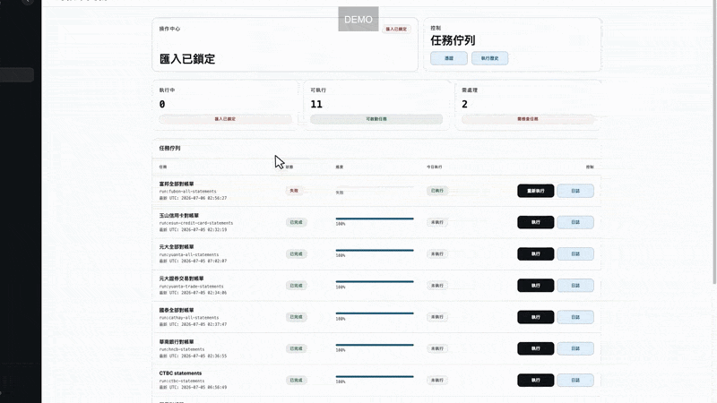

# OctopusBeak

[English](README.md)

針對台灣金融服務打造的個人銀行與電子發票自動化工具，並提供本機資產與消費儀表板。

OctopusBeak 使用 Libretto 執行銀行網站流程、下載帳務資料、將檔案整理成 CSV/JSON、匯入本機 SQLite 帳本，並透過 Svelte 儀表板檢視結果。

下載的對帳單、瀏覽器工作階段、帳本資料庫、憑證與本機自動化設定都屬於敏感資料。請勿將 `downloads/`、`data/`、`.libretto/`、`.env`、`.env.local`、`settings.json`、`credentials.json` 與 `~/Library/Application Support/OctopusBeak/` 提交到版本控制或放入共享封存檔。

## 功能

- 執行台灣銀行網站的引導式瀏覽器自動化。
- 遇到 CAPTCHA、OTP、Email 驗證或憑證選擇時暫停，等待使用者操作。
- 在 `#/automation` 提供憑證管理、工作執行、日誌、重試與人工協助。
- 將整理後的對帳單輸出到 `downloads/<workflow-name>/`。
- 將下載的 CSV 匯入 `data/ledger/ledger.sqlite`。
- 以 headless 瀏覽器擷取個人電子發票，必要時透過 Assist 視窗處理 CAPTCHA。
- 在 `#/overview`、`#/assets` 與 `#/liabilities` 顯示本機資產檢視。
- 在 `#/spending` 顯示已確認電子發票的月度與每日分類圖表、發票明細，並可編輯每個品項的分類。
- 將 MAX/MaiCoin 餘額與交易紀錄同步到同一個帳本。

## 自動化示範



自動化面板會依序執行銀行對帳單工作；富邦要求 CAPTCHA 時，工作會暫停並等待人工協助，完成驗證後再繼續。

## 快速開始

```bash
npm install
npm run libretto:setup
npm run typecheck
```

啟動桌面應用程式：

```bash
npm run desktop:dev
```

桌面介面僅支援 Electron，並從 `#/overview` 載入靜態 renderer。

## 桌面應用程式

OctopusBeak 是 macOS Electron 應用程式。桌面程式載入靜態 Svelte renderer，並透過 Electron preload API 傳遞資料、自動化、設定、憑證與人工協助操作。執行時資料存放於：

```text
~/Library/Application Support/OctopusBeak/
```

其中包含桌面版 `settings.json`、儲存憑證後產生的本機 `credentials.json`、Libretto 狀態、`downloads/`、自動化日誌，以及 `data/ledger/ledger.sqlite`。

在 Electron 中執行：

```bash
npm run desktop:dev
```

建立未簽署的本機應用程式：

```bash
npm run desktop:package
open out/OctopusBeak-darwin-arm64/OctopusBeak.app
```

建立已簽署並完成公證的 macOS 發行檔：

```bash
OCTOPUSBEAK_SIGN=1 OCTOPUSBEAK_NOTARY_PROFILE=OctopusBeakNotary npm run desktop:make
```

產物位於 `out/make/`。簽署設定與 smoke test 步驟請參閱[桌面版發行文件](docs/desktop-release.md)。

## 建議操作流程

1. 啟動桌面應用程式並開啟 `#/automation`。
2. 儲存所需資料來源的登入憑證。
3. 從工作表格執行 crawler 或同步工作。
4. 工作等待人工輸入時，從 Assist 視窗完成瀏覽器驗證。
5. 當天所有已啟用且會產生可匯入資料的 crawler 都有一次完成或部分完成的執行後，再執行 CSV 匯入。
6. 前往 `#/overview`、`#/assets`、`#/liabilities` 或 `#/spending` 檢視結果。

也可以使用 CLI 執行相同流程：

```bash
npm run run:fubon-all-statements
npx libretto resume --session <session-name>
npm run run:import-downloads-csv
npm run desktop:dev
```

清除中斷的瀏覽器工作階段：

```bash
npm run libretto:close-all
```

## 自動化面板

`#/automation` 頁面封裝現有 npm scripts。非機密開關存放於 `settings.json`，機密憑證存放於本機 `credentials.json`，工作歷史寫入 `data/ledger/ledger.sqlite`，完整日誌寫入 `data/automation/logs/`，SQLite 只保留最新的日誌尾端。

在當天所有已啟用、會產生資料的 crawler 都有一次完成或部分完成的執行前，`import downloads csv` 會保持鎖定。

在 **憑證 → 要收集的對帳單** 中選擇的對帳單類型屬於非機密設定，會儲存在 `settings.json`。升級後，多類型銀行需要先明確選擇一次；單一類型銀行會初始化為目前類型，新支援的類型則會維持關閉，直到選取為止。同一家銀行的已選類型會共用一次登入工作階段。部分完成的執行會保留已成功下載的檔案，並允許帶警告執行匯入。

`credentials.json` 僅供本機使用、已加入忽略清單，並在桌面執行環境中由 Electron `safeStorage` 加密。若 `safeStorage` 無法提供加密，桌面程式會停止啟動，不會將憑證以明文寫入。

常用的 `settings.json` 設定：

```json
{
  "AUTOMATION_BUSINESS_TIMEZONE": "Asia/Taipei",
  "LIBRETTO_CLOUD_FUBON_ENABLED": true,
  "LIBRETTO_CLOUD_ESUN_ENABLED": true,
  "LIBRETTO_CLOUD_YUANTA_ENABLED": true,
  "LIBRETTO_CLOUD_YUANTA_STATEMENT_TYPES": "deposit,foreign_currency,credit_card",
  "LIBRETTO_CLOUD_YUANTA_TRADE_ENABLED": true,
  "LIBRETTO_CLOUD_CATHAY_ENABLED": true,
  "LIBRETTO_CLOUD_HNCB_ENABLED": true,
  "LIBRETTO_CLOUD_LINEBANK_ENABLED": true,
  "LIBRETTO_CLOUD_EINVOICE_ENABLED": true,
  "MAX_ENABLED": true,
  "MAX_SUB_ACCOUNT": "main"
}
```

將群組旗標設為 `false`，或設為像是 `"0"`、`"no"`、`"off"`、`"disabled"` 的字串，即可從自動化面板隱藏該資料來源。匯入工作沒有憑證，因此會持續顯示。

直接使用 `libretto run src/workflows/foo.ts` 開發時，請透過 shell 環境變數提供憑證。若憑證放在已忽略的 `.env.local`，先執行 `set -a; source .env.local; set +a`；Libretto 不會自動載入該檔案。工作流程仍從 `process.env` 讀取資料；桌面版 JSON 儲存只會由自動化 runner 注入。

## 支援的工作流程

| 資料來源 | 指令 | 輸出 |
| --- | --- | --- |
| 富邦 | `npm run run:fubon-all-statements` | 存款、信用卡、貸款對帳單 |
| 富邦 | `npm run run:fubon-statements` | 存款對帳單 |
| 富邦 | `npm run run:fubon-credit-card-statements` | 信用卡對帳單 |
| 富邦 | `npm run run:fubon-loan-statements` | 貸款對帳單 |
| 玉山 | `npm run run:esun-credit-card-statements` | 信用卡對帳單 |
| 元大 | `npm run run:yuanta-all-statements` | 台幣、外幣、貸款、信用卡、基金資料 |
| 元大 | `npm run run:yuanta-statements` | 台幣帳戶對帳單 |
| 元大 | `npm run run:yuanta-foreign-currency-statements` | 外幣帳戶對帳單 |
| 元大 | `npm run run:yuanta-loan-statements` | 貸款對帳單 |
| 元大 | `npm run run:yuanta-credit-card-statements` | 信用卡對帳單 |
| 元大 | `npm run run:yuanta-fund-statements` | 基金持倉與交易紀錄 |
| 元大 | `npm run run:yuanta-trade-statements` | 證券持倉與交易紀錄 |
| 國泰 | `npm run run:cathay-all-statements` | 台幣與外幣對帳單 |
| 國泰 | `npm run run:cathay-statements` | 台幣帳戶對帳單 |
| 國泰 | `npm run run:cathay-foreign-statements` | 外幣帳戶對帳單 |
| 華南 | `npm run run:hncb-statements` | 台幣帳戶對帳單 |
| 中信 | `npm run run:ctbc-statements` | 台幣帳戶對帳單 |
| 郵局 | `npm run run:post-statements` | 台幣帳戶對帳單 |
| 永豐 | `npm run run:sinopac-statements` | 台幣與外幣對帳單 |
| LINE Bank | `npm run run:linebank-statements` | 台幣與外幣對帳單 |
| 電子發票 | `npm run run:einvoice-personal-invoices` | 個人發票與消費品項 |
| MAX/MaiCoin | `npm run run:sync-maicoin` | 加密貨幣餘額與交易紀錄 |

## 輸出格式

工作流程輸出位於 `downloads/<workflow-name>/`。

建議輸出結構：

- 每個匯出資料集一個 CSV 表格。
- 同一個時間戳記檔名搭配一個 JSON metadata 檔案。
- 資料來源包含時間時，資料列由新到舊排序。
- CSV 表格內不混入 metadata 資料列。

## 本機帳本

匯入新下載資料：

```bash
npm run run:import-downloads-csv
```

匯入器會寫入 `data/ledger/ledger.sqlite`。一般資料來源會追蹤已匯入路徑，避免重複讀取同一下載檔。交易資料會依類型寫入帳戶交易、信用卡明細、貸款交易、基金、證券、個人發票、發票品項與加密貨幣資料表。自動化歷史則寫入同一資料庫的 `automation_task_runs`。

個人電子發票 CSV 可以重新匯入。穩定的發票與品項 key 會更新來源欄位而不產生重複紀錄；使用者編輯過的 `personal_invoice_items.category` 會保留。新品項會依關鍵字自動分類為 `food`、`daily`、`transport`、`shopping`、`home`、`leisure` 或 `other`。

需要時可直接執行資料庫 migration：

```bash
npm run run:migrate-ledger-db
```

## 模擬帳本

建立含假資料的本機 SQLite 帳本：

```bash
npm run run:seed-mock-ledger-db
```

此指令會重建 `data/mock-ledger/ledger.sqlite`。資料庫包含銀行、外幣、信用卡、貸款、基金、證券與 MAX/MaiCoin 儀表板所需的模擬資料。`data/` 已被 git 忽略，因此產生的 SQLite 檔案不會提交。

只使用模擬資料啟動桌面應用程式：

```bash
npm run desktop:dev:mock
```

此模式使用 `data/mock-desktop/` 作為 Electron user data 目錄，不會讀取 `~/Library/Application Support/OctopusBeak/` 內的正常桌面帳本。

## MAX/MaiCoin 同步

直接同步前，先匯出必要金鑰：

```bash
MAX_ACCESS_KEY=...
MAX_SECRET_KEY=...
MAX_SUB_ACCOUNT=main
```

執行同步：

```bash
npm run run:sync-maicoin
```

此指令會將目前餘額、M-wallet 負債、台幣估值，以及可取得的交易、入金、出金、轉帳、獎勵與兌換紀錄寫入本機帳本。若也要將取得的交易紀錄輸出為 JSON：

```bash
npm run run:sync-maicoin -- --statement-json data/ledger/maicoin-statement.json
```

## 開發

```bash
npm run typecheck
npm run build
npm run check:libretto-patch
npm run run:example
```

常用專案路徑：

| 路徑 | 用途 |
| --- | --- |
| `src/workflows/` | Libretto 瀏覽器工作流程 |
| `src/ledger/` | 匯入器、parser、migration 與儀表板 model |
| `src/lib/shared-ledger/` | 本機帳本查詢與帳戶摘要 helper |
| `src/lib/assets/`、`src/lib/overview/`、`src/lib/liabilities/` | 資產儀表板檢視 |
| `src/lib/spending/` | 個人發票消費 model 與介面 |
| `src/lib/automation/` | 自動化面板介面與 server helper |
| `src/lib/shared-*` | 共用儀表板 shell、帳戶、指標與金額程式碼 |
| `electron/` | Electron main process、runtime helper 與 probe |
| `forge.config.cjs` | Electron Forge 打包與簽署設定 |
| `downloads/` | 本機對帳單輸出 |
| `data/ledger/` | 本機 SQLite 帳本 |
| `~/Library/Application Support/OctopusBeak/` | 打包後桌面應用程式的執行資料 |

分享變更前請執行：

```bash
npm run privacy-check
npm run secrets-check
```
