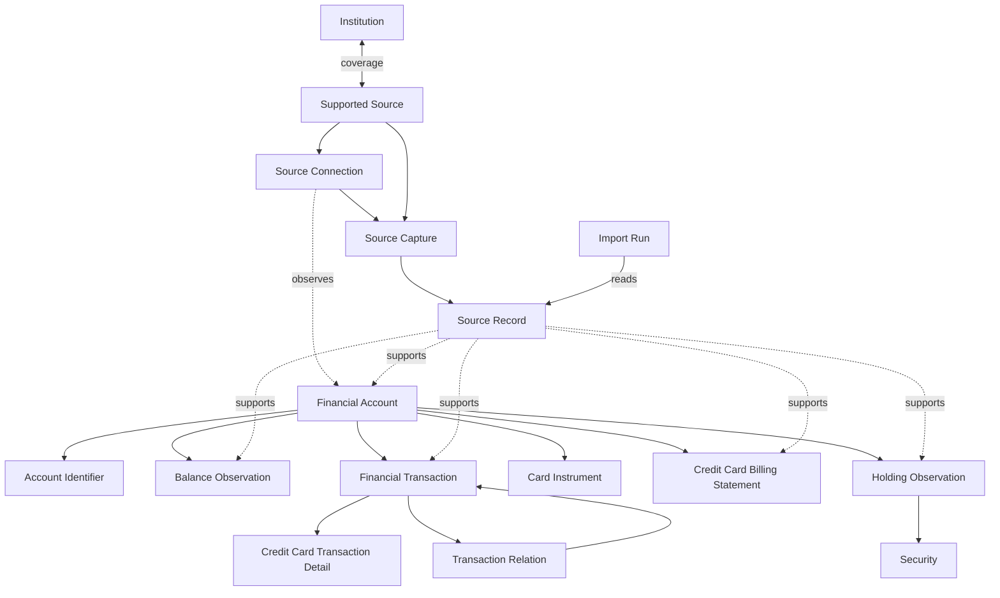

# Plaid-inspired canonical financial model

Status: accepted

[ADR 0008](./0008-source-scoped-lineage-and-strict-canonical-admission.md) amends this model's identity, source-evidence retention, admission, temporal requirements, `unknown`, candidate, and user-correction semantics. Where this ADR describes provisional or cross-source identity, raw replayable records, optional Balance/Holding effective time, canonical conflicts, or financial match candidates, ADR 0008 governs.

## Context

OctopusBeak currently preserves source-specific rows for bank deposits, foreign-currency deposits, credit cards, loans, funds, brokerage, and crypto data. Those rows have useful ingestion lineage but do not form one stable domain model. In particular, current sources do not consistently provide provider account, transaction, or statement identifiers; query periods do not establish statement coverage; a transaction-row running balance is not an independent live balance; and workflow, filename, parser, and product labels include inference that must not be presented as source fact.

The decision uses two research baselines:

- [Plaid account, transaction, and synchronization semantics](../research/plaid-accounts-transactions-semantics.md)
- [OctopusBeak bank source and storage capabilities](../research/octopusbeak-bank-source-capabilities.md)

Plaid is a model reference only. This decision does not plan or require a Plaid integration and does not assume that Plaid identifiers, cursors, webhooks, pending matching, merchant enrichment, or category enrichment exist in Taiwan sources.

## Decision

OctopusBeak adopts a logical canonical model centered on source-scoped Financial Accounts and immutable compact source evidence. Canonical projections remain traceable to Source Records and distinguish source facts from inference; unresolved required semantics fail strict admission instead of becoming canonical uncertainty.

This ADR fixes domain entities, relations, field requirements, and terminology. It does not prescribe physical tables, workflow boundaries, migration sequencing, or whether a relation is stored as a table, structured column, or graph edge. The planned workflow refactor may revise those implementation choices without changing the semantic boundaries below.

### Institution, Supported Source, and Source Connection

An Institution is the canonical identity of the real-world provider that maintains a Financial Account. A Supported Source is a verified collection and import integration. Their coverage mapping is many-to-many: one Institution may have separate deposit, credit-card, loan, fund, or brokerage sources, while a future aggregator source may cover multiple Institutions.

A Source Connection is a user-specific operational relationship with a Supported Source and namespaces the source-scoped Financial Accounts it exposes. Accounts from another connection never share canonical identity; connection failure, replacement, or deletion does not by itself establish account closure.

Plaid institution IDs, portal IDs, workflow codes, bank codes, and brands are external identifiers rather than canonical Institution identity. The Institution taxonomy is technical and does not declare that every fund or crypto provider has a particular Taiwan regulatory status.

| Entity | Required | Optional or conditional |
| --- | --- | --- |
| Institution | contract-established local ID, canonical name, provider type | jurisdiction, parent group, external identifiers, display metadata |
| Supported Source | local ID, name, verified coverage and support state | collector/parser versions, capability metadata |
| Institution source coverage | Institution, Supported Source, covered product | evidence and verification time |
| Source Connection | local ID, Supported Source, connection status | Institution hints, connected/last-successful time, consent metadata, configuration reference |
| Source sync state | Source Connection, product stream, opaque state | Financial Account scope, cursor, last-successful time, health detail |

Authentication secrets never enter this model. A sync cursor is operational state, not financial evidence; its scope and advancement follow the source protocol rather than a global connection cursor convention.

### Source evidence and processing

A Source Capture is the immutable metadata envelope for one independently observed source event that passed its versioned contract and sync admission checks. A Source Record is an immutable compact evidence projection inside exactly one Capture; the first version retains no raw replayable file, response, or page. An Import Run atomically reads Source Records and creates projections; reprocessing creates another run, not another Capture.

| Entity | Required | Optional or conditional |
| --- | --- | --- |
| Source Capture | local ID, Supported Source, Source Connection, observation time, declared scope, completeness, contract version | operational request metadata |
| Source Record | local ID, Source Capture, record kind, compact contract-defined values and source identity, provenance | optional provider metadata retained by the compact contract |
| Import Run | local ID, processing status, start time, parser/rule version | completion time, error summary |

Every canonical entity has entity-level lineage to its supporting Source Records. Direct `source_fact` fields may inherit that lineage. An inferred, normalized, or user-governed field has field-level provenance with field path, value origin, evidence, and applicable rule version. User assertions coexist with immutable evidence, never rewrite it, and are limited by ADR 0008 to display names, categories, tags, and notes.

### Financial Account and identity

A Financial Account is the stable source-scoped representation established within one integration namespace, Source Connection, contract-defined stable key, and Identity Epoch. It persists across Captures and Import Runs in that scope but is never merged with an Account from another integration or connection.

The required account types are:

- `depository`
- `credit`
- `loan`
- `investment`
- `other`

Current product paths support `depository`, `credit`, `loan`, and `investment`. Subtype is optional and evidence-gated. A credit-card account is `credit / credit_card`; a crypto exchange or self-custody wallet is `investment / crypto_exchange` or `investment / non_custodial_wallet` when its account boundary is supported by source evidence.

| Field | Requirement | Rule |
| --- | --- | --- |
| `financial_account_id` | required | Stable local ID; never a source row ID or account-number hash |
| Institution | required | Integration contract must resolve it uniquely before admission |
| `account_type` | required | One of the canonical top-level types |
| canonical entity lineage | required | Links account identity to supporting Source Records |
| `account_subtype` | optional | Never inferred solely from workflow name |
| display name | optional | Source-backed or user asserted |
| default currency | optional | Never overrides transaction or balance currency |

A Financial Account may contain multiple currencies. Currency-specific files do not prove separate currency subaccounts. A separate currency subaccount is created only when the source establishes independent identity.

An Account Identifier is the stable source key that the Integration contract scopes by namespace, Source Connection, and Identity Epoch. Masks, labels, source-file IDs, row IDs, content hashes, filename-derived keys, and user input cannot establish identity; an Integration without a unique stable key cancels the attempted Capture.

### Card Instrument

A Card Instrument is a physical or virtual primary or supplementary card associated with a `credit / credit_card` Financial Account. Different card numbers or masks do not by themselves establish separate Financial Accounts. Card-number masks belong to Card Instruments unless the source explicitly identifies them as account-level identifiers.

| Required | Optional |
| --- | --- |
| local ID, Financial Account, lineage | instrument kind, primary/supplementary role, mask, source label, holder label, active dates |

### Balance Observation

A Balance Observation is a typed, time-bound measurement associated with a Financial Account. Balances are not mutable account fields. Balance kinds include ledger/current, available, credit limit, amount due, and margin loan, with additional kinds introduced only when their source meaning is defined.

| Field | Requirement |
| --- | --- |
| local ID, Financial Account | required |
| balance kind | required |
| non-negative or signed amount according to the defined balance kind, plus currency | required |
| collection time | required |
| contract-defined effective time | required |
| canonical entity lineage | required |
| derivation metadata | required when derived |

A transaction row's `balance_after` may support a derived Balance Observation but remains marked as derived and is never advertised as a real-time provider balance. Credit-card capture totals are likewise local projections, not provider balance objects. An investment account's undifferentiated margin debt is a `margin_loan` Balance Observation; an independently identifiable borrowing is a separate `credit` or `loan` Financial Account rather than a liability holding.

### Financial Transaction

All account types share one Financial Transaction entity. Credit-card transactions do not have a separate identity or lifecycle.

| Field | Requirement | Rule |
| --- | --- | --- |
| `financial_transaction_id` | required | Stable local ID |
| Financial Account | required | Establishes account-relative meaning |
| amount | required | Exact non-negative magnitude booked to the Financial Account |
| currency | required | Explicit denomination; inference is allowed only from traceable source or Integration evidence |
| direction | required | `inflow` or `outflow` across the Financial Account boundary; ambiguous source rows are not promoted |
| `effective_on` | required | Local calendar date selected deterministically |
| `effective_on_basis` | required | `occurred`, `authorized`, `posted`, `accounting`, or `inferred` |
| `posting_status` | required | `pending` or `posted`; unresolved source semantics cancel the attempted Capture |
| canonical entity lineage | required | One or more supporting Source Records |
| description and raw description | optional | Raw source text is distinct from enrichment |
| occurred, authorized, posted, and accounting date/time observations | optional | Kept separately with precision, time origin, source timezone, and UTC normalization semantics |
| provider transaction ID | deferred | Not required by current Taiwan sources |
| merchant, counterparty, and category enrichment | optional | Never treated as source fact without evidence |

Signed report values are derived from amount and direction; the canonical model does not copy Plaid's provider-specific positive-outflow sign convention.

`posting_status` is independent of billing, payment, refund, reversal, and projection state. [ADR 0007](./0007-canonical-transaction-status-and-relation-semantics.md) defines it by account-ledger booking, while ADR 0008 requires a total verified Integration mapping and cancels an attempted Capture whose required status cannot be resolved.

A Financial Transaction belonging to a `credit / credit_card` account may have one Credit Card Transaction Detail component. The component has no independent ID or lifecycle. Its optional fields include Card Instrument, optional `unbilled | billed` billing status, Credit Card Billing Statement membership, original amount and currency, provenance-bearing conversion evidence, installment detail, and source payment status. An unsupported optional fact is absent rather than `unknown`.

An optional Transaction Relation links two transactions without merging or deleting them. Initial types are `pending_to_posted`, `refund_of`, `reversal_of`, `transfer_counterpart`, and `installment_of`; ADR 0007 fixes their direction and cardinality, while ADR 0008 requires contract-established source-scoped evidence and stores no match candidates.

Source removal is projection lifecycle, not economic evidence of refund, reversal, or cancellation. When a provider protocol supplies added, modified, or removed patches, its cursor and mutation semantics remain in Source Sync State and projection processing rather than being copied into transaction status.

### Credit Card Billing Statement and Statement Document

A Credit Card Billing Statement is an evidence-gated, settled billing-cycle summary for a `credit / credit_card` Financial Account. It exists only when the source identifies a settled statement or provides enough billing-cycle facts to establish one.

| Required | Optional |
| --- | --- |
| local ID, Financial Account, lineage, evidence sufficient to establish a settled cycle | source statement ID, period start/end, issue date, due date, statement currency, statement balance, minimum payment, totals, transaction membership |

A deposit transaction query, CSV export, filename, Source Capture, and unbilled credit-card list are not Statements. Statement period, issue, and due dates belong to the Credit Card Billing Statement rather than becoming transaction date observations; a billed status may exist without Statement membership. The first version retains only the Integration's compact Statement evidence rather than a replayable provider-issued document, and file form alone never establishes a canonical Statement.

### Security and Holding Observation

OctopusBeak keeps Plaid's technical Security umbrella. Security types include equity, ETF, mutual fund, fixed income, derivative, cash, cryptocurrency, loan, and other. `Security / cryptocurrency` is a data-taxonomy choice and does not assert that the asset is legally a security in Taiwan.

A Holding Observation is a source-reported evidence checkpoint for a Security held in an `investment` Financial Account. It does not replace Investment Transaction history, and Investment Transactions cannot be assumed to reconstruct holdings without a complete opening position, transaction history, corporate actions, transfers, and prices.

| Entity | Required | Optional or conditional |
| --- | --- | --- |
| Security | contract-established source-scoped identity, security type, lineage | provider identifiers, name, ticker, currency, display metadata |
| Holding Observation | local ID, Financial Account, Security, contract-defined effective time, observation time, lineage, and at least one usable quantity or valuation | cost basis, price, valuation currency |

A Holding Observation requires at least one usable quantity or valuation. The current holding is a projection from the latest valid observation; OctopusBeak does not synthesize daily snapshots when the source provides no observation.

BTC, ETH, and similar assets are Securities referenced by crypto Holding Observations rather than Financial Accounts. Provider wallet labels create separate Financial Accounts only when independent ledger, balance, transaction-scope, or wallet identity is established.

## Plaid alignment classification

| Classification | Concepts |
| --- | --- |
| Plaid-aligned | Institution as a provider reference; Account type/subtype hierarchy; Account-linked Transactions; Security; Holding; `depository`, `credit`, `loan`, and `investment`; `credit / credit_card`; `investment / crypto_exchange` and `non_custodial_wallet` |
| Taiwan-adjusted | Source-scoped Financial Account identity; contract-defined stable Account Identifier; multi-currency account boundary; non-negative Transaction amount plus explicit direction; multiple transaction dates plus effective-date basis; typed Balance Observations; Holding observations retained as checkpoints |
| OctopusBeak-added | Supported Source coverage; Source Connection as identity namespace; Source Capture, compact Source Record, and atomic Import Run; origin-specific assertion lineage; Identity Epoch; Source Authority Routing; Contract Purge; Card Instrument; Credit Card Transaction Detail; generic Transaction Relation |
| Excluded from canonical model | Workflow and filename labels as identities; source-row and content hashes as account IDs; mutable current balances; account-per-currency inference; card-per-account inference; generic Statement inferred from an export; separate CreditCardTransaction entity; liability Holding; authentication secrets |
| Deferred until evidence requires it | Provider account/transaction IDs; provider cursor/webhook storage beyond generic Source Sync State; exact Taiwan account-subtype vocabulary; universal transaction-kind taxonomy; automatic merchant/category enrichment; physical schema and migration plan |

## Consequences

- Canonical projections require more explicit relations and provenance than the current typed source tables.
- Accounts and Transactions remain source-scoped; Source Authority Routing prevents duplicate projection inputs without cross-source identity reconciliation.
- Product queries derive current account, balance, and holding views from evidence-backed observations rather than assuming the latest imported row is authoritative.
- Credit-card, investment, loan, and deposit sources share core account and transaction vocabulary while retaining type-specific components.
- Workflow and schema refactors must preserve immutable evidence, value origin, and the separation between collection, processing, and financial facts.
- Future provider integrations can add external identifiers and protocol-specific sync state without changing canonical local identity.

## Rejected alternatives

- Copy Plaid objects and identifiers directly: current Taiwan sources do not provide the necessary IDs, mutation stream, webhook, or enrichment guarantees.
- Keep only source-specific tables: this prevents stable cross-source accounts and a common trusted overview.
- Collapse captures, import runs, and task runs: this confuses evidence with processing and cannot represent safe reprocessing.
- Treat each currency, card mask, or workflow output as an account: the current sources do not establish those identity boundaries.
- Rebuild holdings from transactions alone: current sources do not prove complete transaction and valuation history.
- Infer Statements from query periods or filenames: those values do not establish coverage or finality.
