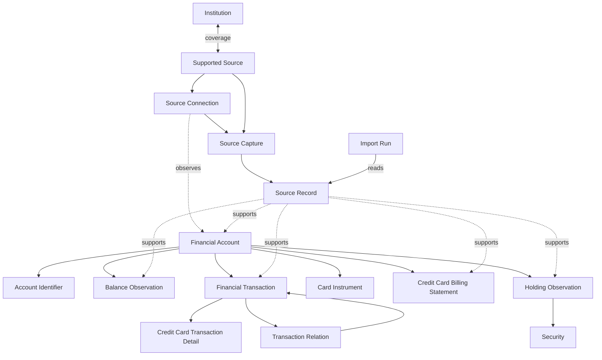

# Plaid-inspired canonical financial model

Status: accepted

## Context

OctopusBeak currently preserves source-specific rows for bank deposits, foreign-currency deposits, credit cards, loans, funds, brokerage, and crypto data. Those rows have useful ingestion lineage but do not form one stable domain model. In particular, current sources do not consistently provide provider account, transaction, or statement identifiers; query periods do not establish statement coverage; a transaction-row running balance is not an independent live balance; and workflow, filename, parser, and product labels include inference that must not be presented as source fact.

The decision uses two research baselines:

- [Plaid account, transaction, and synchronization semantics](../research/plaid-accounts-transactions-semantics.md)
- [OctopusBeak bank source and storage capabilities](../research/octopusbeak-bank-source-capabilities.md)

Plaid is a model reference only. This decision does not plan or require a Plaid integration and does not assume that Plaid identifiers, cursors, webhooks, pending matching, merchant enrichment, or category enrichment exist in Taiwan sources.

## Decision

OctopusBeak adopts a logical canonical model centered on stable local Financial Accounts and immutable source evidence. Canonical projections remain traceable to Source Records, distinguish source facts from inference, and preserve uncertainty instead of forcing identity matches or provider semantics that the source cannot support.

This ADR fixes domain entities, relations, field requirements, and terminology. It does not prescribe physical tables, workflow boundaries, migration sequencing, or whether a relation is stored as a table, structured column, or graph edge. The planned workflow refactor may revise those implementation choices without changing the semantic boundaries below.

### Institution, Supported Source, and Source Connection

An Institution is the canonical identity of the real-world provider that maintains a Financial Account. A Supported Source is a verified collection and import integration. Their coverage mapping is many-to-many: one Institution may have separate deposit, credit-card, loan, fund, or brokerage sources, while a future aggregator source may cover multiple Institutions.

A Source Connection is an optional, user-specific operational relationship with a Supported Source. It may expose multiple Financial Accounts, and the same Financial Account may later be observed through another connection. Connection failure, replacement, or deletion does not close the account. Manual captures do not require a Source Connection.

Plaid institution IDs, portal IDs, workflow codes, bank codes, and brands are external identifiers rather than canonical Institution identity. The Institution taxonomy is technical and does not declare that every fund or crypto provider has a particular Taiwan regulatory status.

| Entity | Required | Optional or conditional |
| --- | --- | --- |
| Institution | local ID, canonical name, provider type, identity status | jurisdiction, parent group, external identifiers, display metadata |
| Supported Source | local ID, name, verified coverage and support state | collector/parser versions, capability metadata |
| Institution source coverage | Institution, Supported Source, covered product | evidence and verification time |
| Source Connection | local ID, Supported Source, connection status | Institution hints, connected/last-successful time, consent metadata, configuration reference |
| Source sync state | Source Connection, product stream, opaque state | Financial Account scope, cursor, last-successful time, health detail |

Authentication secrets never enter this model. A sync cursor is operational state, not financial evidence; its scope and advancement follow the source protocol rather than a global connection cursor convention.

### Source evidence and processing

A Source Capture is the immutable evidence envelope for one source-side collection event at a declared observation time and scope. Its exact workflow mapping and granularity remain revisable. A Source Record is an immutable file, row, or object inside that capture. An Import Run is a processing execution that reads Source Records and creates or reconciles projections; reprocessing evidence creates another Import Run, not another Source Capture.

| Entity | Required | Optional or conditional |
| --- | --- | --- |
| Source Capture | local ID, Supported Source, collection time, declared scope | Source Connection, source-effective time, completeness/finality assertions |
| Source Record | local ID, Source Capture, record kind, immutable payload or content reference, content integrity value, source coordinates | provider metadata |
| Import Run | local ID, processing status, start time, parser/rule version | completion time, error summary |

Every canonical entity has entity-level lineage to its supporting Source Records. Direct `source_fact` fields may inherit that lineage. A field that is inferred, normalized, conflicting, or user asserted has field-level provenance with field path, value origin, evidence, and applicable rule version. The allowed value origins are `source_fact`, `parser_inference`, `normalized_projection`, and `user_assertion`. User assertions coexist with immutable evidence and never rewrite it.

### Financial Account and identity

A Financial Account is the stable local representation of an independently identifiable contractual, ledger, or asset-holding relationship with an Institution. It persists across connections, captures, imports, files, card instruments, and currencies.

The required account types are:

- `depository`
- `credit`
- `loan`
- `investment`
- `other`
- `unknown`

Current product paths support `depository`, `credit`, `loan`, and `investment`. Subtype is optional and evidence-gated. A credit-card account is `credit / credit_card`; a crypto exchange or self-custody wallet is `investment / crypto_exchange` or `investment / non_custodial_wallet` when its account boundary is supported by source evidence.

| Field | Requirement | Rule |
| --- | --- | --- |
| `financial_account_id` | required | Stable local ID; never a source row ID or account-number hash |
| Institution | required | May be provisional when provider identity is unresolved |
| `account_type` | required | One of the canonical top-level types |
| `identity_status` | required | `provisional`, `confirmed`, or `conflicted` |
| canonical entity lineage | required | Links account identity to supporting Source Records |
| `account_subtype` | optional | Never inferred solely from workflow name |
| display name | optional | Source-backed or user asserted |
| default currency | optional | Never overrides transaction or balance currency |

A Financial Account may contain multiple currencies. Currency-specific files do not prove separate currency subaccounts. A separate currency subaccount is created only when the source establishes independent identity.

Account identity evidence is represented by multiple Account Identifiers rather than one global `account_number` field. Initial kinds are `account_number_hash`, `account_mask`, and `source_account_label`. Each identifier records its Financial Account, kind, value, supporting Source Record, observation time, and value origin. Source-file IDs, statement-row IDs, content hashes, and filename-derived ingestion keys are not Account Identifiers. Provider account IDs are deferred until an actual provider integration requires them.

An account stays `provisional` when only masks, labels, or inferred identifiers exist; Institution-scoped account-number evidence or explicit user confirmation may make it `confirmed`; mutually exclusive evidence makes it `conflicted`. Conflict stops silent reconciliation but does not rewrite or delete either source record.

### Card Instrument

A Card Instrument is a physical or virtual primary or supplementary card associated with a `credit / credit_card` Financial Account. Different card numbers or masks do not by themselves establish separate Financial Accounts. Card-number masks belong to Card Instruments unless the source explicitly identifies them as account-level identifiers.

| Required | Optional |
| --- | --- |
| local ID, Financial Account, lineage | instrument kind, primary/supplementary role, mask, source label, holder label, active dates |

### Balance Observation

A Balance Observation is a typed, time-bound measurement associated with a Financial Account. Balances are not mutable account fields. Balance kinds include ledger/current, available, credit limit, amount due, and margin loan, with additional kinds introduced only when their source meaning is defined.

| Field | Requirement |
| --- | --- |
| local ID, Financial Account | required |
| balance kind | required |
| non-negative or signed amount according to the defined balance kind, plus currency | required |
| collection time | required |
| source-effective time | optional when the source does not provide it |
| canonical entity lineage | required |
| derivation metadata | required when derived |

A transaction row's `balance_after` may support a derived Balance Observation but remains marked as derived and is never advertised as a real-time provider balance. Credit-card capture totals are likewise local projections, not provider balance objects. An investment account's undifferentiated margin debt is a `margin_loan` Balance Observation; an independently identifiable borrowing is a separate `credit` or `loan` Financial Account rather than a liability holding.

### Financial Transaction

All account types share one Financial Transaction entity. Credit-card transactions do not have a separate identity or lifecycle.

| Field | Requirement | Rule |
| --- | --- | --- |
| `financial_transaction_id` | required | Stable local ID |
| Financial Account | required | Establishes account-relative meaning |
| amount | required | Non-negative magnitude |
| currency | required | Inference is allowed only with field provenance |
| direction | required | `inflow`, `outflow`, or `unknown` from the account perspective |
| `effective_on` | required | Local calendar date selected deterministically |
| `effective_on_basis` | required | `transaction`, `authorized`, `posted`, `accounting`, or `inferred` |
| `posting_status` | required | `pending`, `posted`, or `unknown` |
| canonical entity lineage | required | One or more supporting Source Records |
| description and raw description | optional | Raw source text is distinct from enrichment |
| occurred, authorized, posted, and accounting date/time observations | optional | Kept separately; absent time or zone is not fabricated |
| provider transaction ID | deferred | Not required by current Taiwan sources |
| merchant, counterparty, and category enrichment | optional | Never treated as source fact without evidence |

Signed report values are derived from amount and direction; the canonical model does not copy Plaid's provider-specific positive-outflow sign convention.

`posting_status` is independent of billing, payment, refund, reversal, and projection state. Missing source status is `unknown`; downloading a row does not prove it is posted.

A Financial Transaction belonging to a `credit / credit_card` account may have one Credit Card Transaction Detail component. The component has no independent ID or lifecycle. Its optional fields include Card Instrument, `unbilled | billed | unknown` billing status, Credit Card Billing Statement membership, original amount and currency, FX date, installment detail, and source payment status. Filename-derived billed/unbilled values are `parser_inference`.

An optional Transaction Relation links two transactions without merging or deleting them. Initial types are `pending_to_posted`, `refund_of`, `reversal_of`, `transfer_counterpart`, and `installment_of`. A relation requires explicit source evidence or a deterministic versioned rule with provenance. Ambiguous matching creates no relation.

Source removal is projection lifecycle, not economic evidence of refund, reversal, or cancellation. When a provider protocol supplies added, modified, or removed patches, its cursor and mutation semantics remain in Source Sync State and projection processing rather than being copied into transaction status.

### Credit Card Billing Statement and Statement Document

A Credit Card Billing Statement is an evidence-gated, settled billing-cycle summary for a `credit / credit_card` Financial Account. It exists only when the source identifies a settled statement or provides enough billing-cycle facts to establish one.

| Required | Optional |
| --- | --- |
| local ID, Financial Account, lineage, evidence sufficient to establish a settled cycle | source statement ID, period start/end, issue date, due date, statement currency, statement balance, minimum payment, totals, transaction membership |

A deposit transaction query, CSV export, filename, Source Capture, and unbilled credit-card list are not Statements. A provider-issued PDF or equivalent file is a Statement Document retained as a Source Record; file form alone does not create a canonical Credit Card Billing Statement.

### Security and Holding Observation

OctopusBeak keeps Plaid's technical Security umbrella. Security types include equity, ETF, mutual fund, fixed income, derivative, cash, cryptocurrency, loan, and other. `Security / cryptocurrency` is a data-taxonomy choice and does not assert that the asset is legally a security in Taiwan.

A Holding Observation is a source-reported evidence checkpoint for a Security held in an `investment` Financial Account. It does not replace Investment Transaction history, and Investment Transactions cannot be assumed to reconstruct holdings without a complete opening position, transaction history, corporate actions, transfers, and prices.

| Entity | Required | Optional or conditional |
| --- | --- | --- |
| Security | local ID, security type, identity status, lineage | provider identifiers, name, ticker, currency, display metadata |
| Holding Observation | local ID, Financial Account, Security, observation time, lineage | quantity, cost basis, price, valuation, valuation time and currency |

A Holding Observation requires at least one usable quantity or valuation. The current holding is a projection from the latest valid observation; OctopusBeak does not synthesize daily snapshots when the source provides no observation.

BTC, ETH, and similar assets are Securities referenced by crypto Holding Observations rather than Financial Accounts. Provider wallet labels create separate Financial Accounts only when independent ledger, balance, transaction-scope, or wallet identity is established.

## Plaid alignment classification

| Classification | Concepts |
| --- | --- |
| Plaid-aligned | Institution as a provider reference; Account type/subtype hierarchy; Account-linked Transactions; Security; Holding; `depository`, `credit`, `loan`, and `investment`; `credit / credit_card`; `investment / crypto_exchange` and `non_custodial_wallet` |
| Taiwan-adjusted | Stable local Financial Account identity; multiple evidence-backed Account Identifiers; multi-currency account boundary; non-negative Transaction amount plus explicit direction; multiple transaction dates plus effective-date basis; typed Balance Observations; Holding observations retained as checkpoints |
| OctopusBeak-added | Supported Source coverage; Source Connection separated from Account; Source Capture, Source Record, and Import Run; entity- and field-level provenance; account identity status; Card Instrument; Credit Card Transaction Detail; generic Transaction Relation |
| Excluded from canonical model | Workflow and filename labels as identities; source-row and content hashes as account IDs; mutable current balances; account-per-currency inference; card-per-account inference; generic Statement inferred from an export; separate CreditCardTransaction entity; liability Holding; authentication secrets |
| Deferred until evidence requires it | Provider account/transaction IDs; provider cursor/webhook storage beyond generic Source Sync State; exact Taiwan account-subtype vocabulary; universal transaction-kind taxonomy; automatic merchant/category enrichment; physical schema and migration plan |

## Consequences

- Canonical projections require more explicit relations and provenance than the current typed source tables.
- Account reconciliation is deliberately conservative; provisional duplicates are preferable to silently combining unrelated accounts.
- Product queries derive current account, balance, and holding views from evidence-backed observations rather than assuming the latest imported row is authoritative.
- Credit-card, investment, loan, and deposit sources share core account and transaction vocabulary while retaining type-specific components.
- Workflow and schema refactors must preserve immutable evidence, value origin, and the separation between collection, processing, and financial facts.
- Future provider integrations can add external identifiers and protocol-specific sync state without changing canonical local identity.

## Rejected alternatives

- Copy Plaid objects and identifiers directly: current Taiwan sources do not provide the necessary IDs, mutation stream, webhook, or enrichment guarantees.
- Keep only source-specific tables: this prevents stable cross-source accounts and a common trusted overview.
- Collapse captures, import runs, and task runs: this confuses evidence with processing and cannot represent safe reprocessing.
- Treat each currency, card mask, or workflow output as an account: the current sources do not establish those identity boundaries.
- Rebuild holdings from transactions alone: current sources do not prove complete transaction and valuation history.
- Infer Statements from query periods or filenames: those values do not establish coverage or finality.
