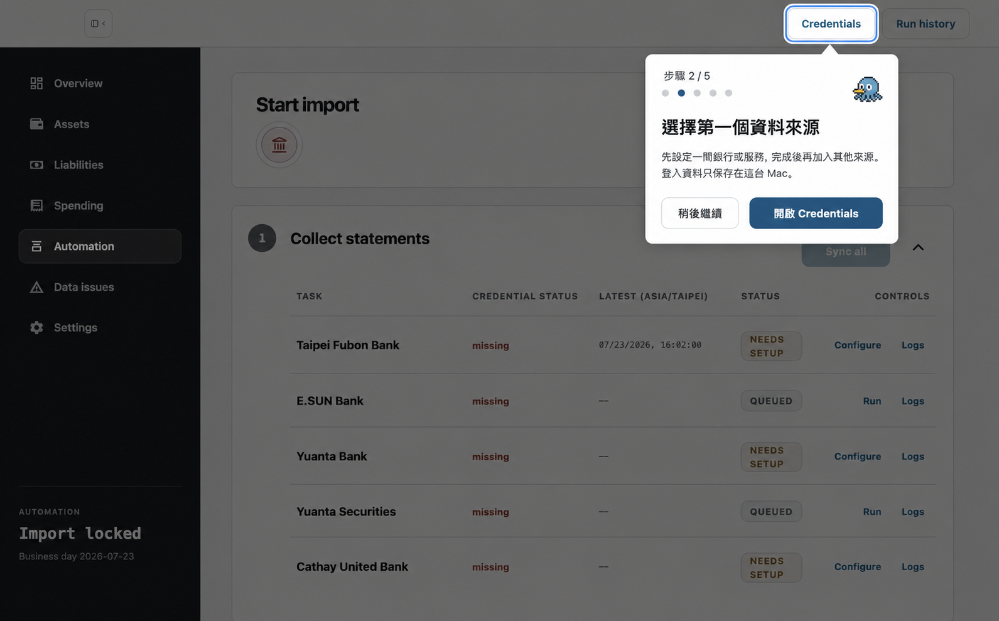

# First-run onboarding design

Date: 2026-07-23

## Goal

Help a first-time OctopusBeak user complete one real end-to-end workflow:

1. Choose one bank or service.
2. Configure its required credentials and statement types.
3. Complete one collection task, including human verification when required.
4. Import the collected data into the local ledger.
5. See the imported result in Overview.

The onboarding is complete only when Overview contains visible account data. Merely clicking through instructions is not completion.

## Product decisions

- Use an in-product contextual coach on the real application screens.
- Advance from product milestones, not from a fixed Next-button sequence.
- Let the user choose the first bank or service.
- If onboarding is closed, preserve progress and resume from the same milestone on the next launch.
- Add Continue onboarding and Restart onboarding actions to Settings.
- Use the selected Precision Spotlight visual direction.
- Keep all credentials and onboarding state local to the Mac.

## Entry and exit rules

Show first-run onboarding when:

- the versioned onboarding state does not exist; and
- Overview has no visible account data; and
- there is no successful prior import that would identify the installation as already configured.

Do not start onboarding for an existing user after an application upgrade merely because browser storage was cleared. Existing ledger data or successful import history suppresses first-run onboarding.

The user may pause onboarding at any time. Escape and the secondary action both pause it without losing the selected source or achieved milestones.

Completion requires:

- the selected collection task finished with `completed` or an importable `partial` result;
- the import task finished with `completed`; and
- Overview exposes at least one visible account row.

After completion, show a short success coach with Finish and Add another source. Finish hides onboarding. Add another source opens the existing Credentials UI without restarting onboarding.

## Milestone flow

### 1. Enter Automation

If the user is on another route, spotlight the Automation navigation item.

Milestone condition: the current route is `automation` and the Automation model is loaded.

### 2. Choose and configure one source

Spotlight the existing Credentials button and open the existing Credentials modal. Explain that the first run uses one source to keep the workflow short.

When the user chooses a source during first-run onboarding:

- remember its credential group ID;
- enable that source;
- disable other collection sources for the first run;
- leave import and non-collection behavior unchanged;
- show the existing credential and statement-type fields;
- save through the existing credentials API.

The copy must state that other sources can be added after the first successful import. This automatic narrowing only applies to a genuinely new installation; it must not disable sources for an existing user.

Inside the Credentials modal, the coach must remain on milestone 2 and hand its
target through these required interactions:

1. a bank or service row;
2. each credential field in display order;
3. an explicit statement-type selection or confirmation when the chosen source requires it;
4. the existing Save action.

The first source must not be treated as chosen merely because it is the first
visible row. During onboarding, stored placeholders never satisfy the interaction:
the user must enter a fresh value for every required credential field in the
current modal session. Existing statement selections remain visible, but the user
must explicitly interact with the selection before Save becomes the coach target.
A successful save records both the chosen group ID and the time at which that
source became configured.

The coach title, body, and action label must describe the current interaction,
not only the five-step milestone. For example, the source row uses “選擇第一間銀行”,
the first field uses “輸入登入資訊”, the statement area uses “確認匯入範圍”, and
Save uses “儲存並開始匯入”.

After Save succeeds, start the selected collection task through the existing
automation API. Do not require a second coach click on the task table.

Milestone condition: the selected group is enabled, every required credential
was freshly entered, required statement selections were explicitly confirmed,
and the selected collection task has started.

### 3. Complete the first collection

Spotlight the selected task's existing Run control. While the task is active, collapse the coach into a small progress capsule so logs and human-assist controls remain usable.

State handling:

- `running`: show progress and remain on this milestone.
- `waiting_for_human`: enter the Assist branch.
- `failed`: show Retry and Logs; do not advance.
- `completed`: advance when the refreshed model confirms completion.
- `partial`: advance only when the existing import gate considers the result importable.

Only a collection whose `latestStartedAt` is at or after the source configuration
time belongs to this onboarding run. Earlier completed, failed, partial, active,
or human-waiting task state must not advance the flow.

### Human verification branch

When a task becomes `waiting_for_human`, spotlight the existing Assist surface. Explain CAPTCHA, OTP, email verification, or certificate selection using the task's existing message.

Opening Assist moves the onboarding target into the Assist modal. The coach must
never continue targeting a control behind that modal. Within Assist, use the
existing interactive screenshot and floating text input as a short task sequence:

1. target the browser screenshot and ask the user to select the CAPTCHA, OTP, or verification control;
2. when the floating input opens, target that real input and ask the user to enter and submit the value;
3. after a viewer click or submitted value, target Resume and label it
   “已完成驗證，繼續收集”.

Hide the full-screen onboarding scrim while the user is operating the bank page;
the Assist modal itself provides the visual boundary. The instruction remains
compact and must not cover the screenshot, floating input, or Resume action.

When the task resumes, return automatically to the collection milestone. The
flow advances only when refreshed automation state confirms the collection
completed or produced an importable partial result. No separate onboarding
completion state is stored for this branch.

Human verification is conditional. If the selected bank completes without
requesting CAPTCHA, OTP, email verification, or certificate selection, the flow
continues directly when collection completes.

### 4. Import the collected data

After the existing import gate unlocks, spotlight Start import. The coach does not create an alternate import path.

State handling:

- locked: explain the current gate reason and wait.
- running: collapse into the progress capsule.
- failed: show Retry and Logs; do not advance.
- completed: navigate the coach to Overview.

Milestone condition: the import task status is `completed`.

The completed import must belong to this onboarding run: its
`latestStartedAt` must be at or after the fresh collection finished. A successful
import from before onboarding cannot skip collection or import guidance.

### 5. Show the result in Overview

Spotlight the existing imported timestamp and first summary area in Overview.

If import completed but Overview remains empty, keep onboarding active and show a compact explanation with links back to Automation and Logs. Do not show a false success state.

Milestone condition: Overview contains at least one visible account row.

## Visual direction

Selected reference:



The underlying application must retain its current design:

- dark left sidebar;
- white workspace;
- monochrome display typography;
- thin gray borders;
- restrained blue action color;
- current spacing, radii, and controls.

The contextual layer adds:

- a translucent charcoal scrim that does not intercept pointer events;
- one precise focus ring around the current real control;
- one compact white coach popover near the target;
- a five-dot milestone indicator;
- a primary action that invokes the existing target control;
- a secondary Pause onboarding action;
- a 20–24 px pixel-art octopus-beak guide icon.

The icon should be generated as a dedicated two-frame raster asset, not drawn with CSS or inline SVG. Animate it only while the coach is idle. Under `prefers-reduced-motion: reduce`, show the first frame without animation.

The coach must reflow or reposition to stay inside the window. It must not cover the highlighted control.

Placement chooses a non-overlapping side in this order:

1. right of the target when the full card fits;
2. left of the target when the full card fits;
3. below or above the target, whichever has sufficient room;
4. a viewport-clamped fallback that still excludes the target rectangle.

Opening the Credentials modal therefore moves the coach beside the modal when
space permits instead of covering credential fields.

## Architecture

### `src/lib/onboarding/state.ts`

Own a small versioned local state and a pure milestone resolver.

Persist:

```ts
type OnboardingState = {
  version: 2;
  status: "active" | "paused" | "completed";
  selectedCredentialGroupId: string | null;
  sourceConfiguredAt: string | null;
};
```

Use a dedicated localStorage key such as `octopusbeak-onboarding-v2`. Version 1
state does not prove that a fresh collection was completed, so it is not
migrated. Existing product data and successful import history still suppress
first-run onboarding for configured installations. This is renderer UI state,
so it does not require a database migration or a new Electron IPC API.

The resolver receives current route, Automation model, Overview model, and persisted state. It returns one display state:

- `automation-nav`;
- `credentials`;
- `collection`;
- `assist`;
- `collection-failed`;
- `import`;
- `import-failed`;
- `overview`;
- `overview-empty`;
- `complete`;
- `hidden`.

The stored object does not contain a mutable numeric step. Achieved milestones are recalculated from real product data so stale stored progress cannot claim success.

### `src/lib/onboarding/OnboardingCoach.svelte`

Render the spotlight, coach card, progress capsule, and completion state.

The component:

- receives the resolver result and pause/restart callbacks;
- locates the current target through stable `data-onboarding` attributes;
- uses the target's bounding rectangle to place the ring and coach;
- updates placement on resize and scroll;
- focuses and activates the existing target for its primary action;
- falls back to a fixed Continue onboarding capsule if the target is temporarily absent;
- announces milestone changes through `aria-live="polite"`.

Do not add a tour dependency.

### Existing screens

`src/routes/+page.svelte`

- own the onboarding state;
- pass loaded route models to the resolver;
- when onboarding storage and Overview data are both absent, load the existing Automation model once without changing routes so prior import status can suppress onboarding;
- render the coach above the current route;
- avoid changing the existing hash router.

`src/lib/shared-shell/components/DashboardShell.svelte`

- add stable markers to Automation navigation and relevant Overview areas.

`src/lib/automation/AutomationDashboard.svelte`

- add markers to Credentials, the selected task's controls, Assist, Start import, Retry, and Logs;
- derive Credentials sub-phases from fresh draft input and explicit statement interaction, not saved placeholders;
- start the selected collection task after a successful onboarding save;
- move Assist targets from the covered background control to the screenshot, floating input, and Resume button;
- report the selected credential group when the existing modal saves successfully;
- preserve existing action handlers and error messages.

`src/lib/settings/SettingsPage.svelte`

- add Continue onboarding when paused;
- add Restart onboarding;
- require confirmation before restart.

The existing translation dictionary receives the new user-facing copy. No separate onboarding configuration framework is needed.

## Data flow

1. `+page.svelte` loads the current route model as it does today.
2. For an otherwise-empty installation, it loads the existing Automation model once to distinguish a new user from an existing user with no currently visible accounts.
3. The resolver combines route data with the versioned local onboarding state.
4. The coach renders the returned display state and locates its marked target.
5. The user acts through the existing product control.
6. Existing APIs update credentials, task runs, import state, and ledger data.
7. Existing reloads refresh the page model.
8. The resolver observes the real milestone and returns the next state.

The coach never writes ledger or automation task status.

## Error handling

- Credential validation or save failure: keep the Credentials milestone and show the existing modal error.
- Missing spotlight target: keep state intact and show the fixed Continue onboarding capsule.
- Collection failure: show Retry and Logs; remain on collection.
- Human verification: route to Assist and resume collection afterward.
- Import gate locked: show its existing reason and remain on import.
- Import failure: show Retry and Logs; remain on import.
- Import completes but Overview is empty: show Overview empty guidance and remain active.
- Storage contains invalid or unknown data: ignore it and start from state version 1.
- A future onboarding version changes milestone semantics: use a new storage key or explicit migration.

## Accessibility

- Use real buttons for all coach actions.
- Keep the coach non-modal so the highlighted product control remains operable.
- Ensure the spotlight scrim uses `pointer-events: none`.
- Move focus only after an explicit coach action.
- Escape pauses onboarding.
- Announce milestone changes without announcing polling refreshes.
- Maintain at least WCAG AA contrast.
- Disable movement and icon animation under reduced-motion preferences.
- Keep the focused product control visibly outlined for keyboard users.

## Testing and verification

Add one focused runnable check at `src/lib/onboarding/state.check.ts`.

It covers:

- first-run entry;
- existing-user suppression;
- selected-source persistence;
- first-run narrowing to one enabled collection source;
- completed and importable-partial collection;
- failed collection;
- human-assist branch;
- locked, failed, and completed import;
- completed import with empty Overview;
- final completion;
- pause and resume;
- invalid stored state.
- modal target handoff from source selection through required fields to Save;
- saved credential placeholders cannot bypass fresh onboarding input;
- existing statement selections require explicit confirmation before Save;
- a successful onboarding save starts only the selected collection task;
- Assist target handoff from screenshot to floating input to Resume;
- opening Assist removes the target from the covered background control;
- coach placement that never intersects its target;
- stale collection and import timestamps that must not advance a new run;
- conditional human verification followed by collection resume.

Run:

```bash
npm test -- src/lib/onboarding/state.check.ts
npm run typecheck
```

Use Electron CDP for one manual visual pass:

1. Start the mock desktop app with fresh onboarding storage.
2. Verify every spotlight target on a 1280 × 726 window.
3. Resize the window and confirm the coach stays visible.
4. Verify keyboard focus, Escape pause, resume, restart, and reduced motion.
5. Confirm task failure and `waiting_for_human` do not incorrectly advance.
6. Confirm completion requires visible Overview data.

## Deliberate omissions

- No analytics or event-tracking service.
- No onboarding database table.
- No new Electron IPC surface for progress.
- No general-purpose tour framework.
- No dedicated onboarding route.
- No multi-source first-run flow.
- No mobile or web-specific layout.

Add analytics only when the product has a defined telemetry and privacy policy. Add a general tour system only when a second unrelated guided workflow proves the abstraction is necessary.
